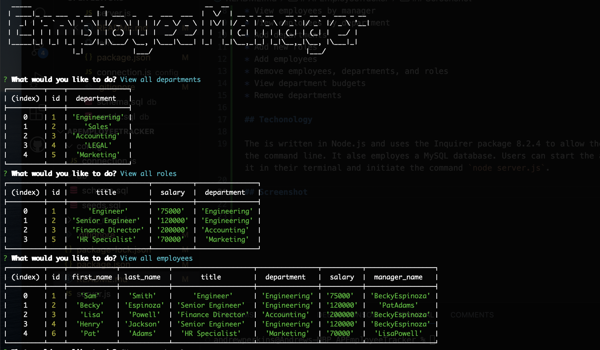

# APEmployeeTracker

AP Employee Tracker is a command line application for business owners to manage their employees in a MySQL database. The application allows business managers to:

* View all departments
* View all employee roles
* View all employees
* View employees by manager
* View employees by department
* Add departments
* Add new roles
* Add employees
* Remove employees, departments, and roles
* View department budgets
* Remove departments

## Techonology

The is written in Node.js and uses the Inquirer package 8.2.4 to allow the user to interact via the command line. It alse employes a MySQL database. Users can start the application by accessing it in their terminal and initiate the command `node server.js`.

## Screenshot

## Video Demonstration

[Here is a link to a video demonstration of the application!](https://drive.google.com/file/d/1XdaQh6HY3JNJQ1betFBGQRaS68KIKFBw/view?usp=sharing)

## Credits

Special thanks to my tutoring section for assisting with two of the bonus functions.

